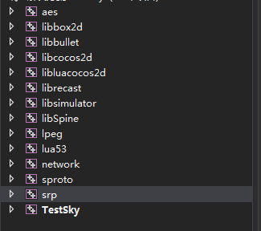
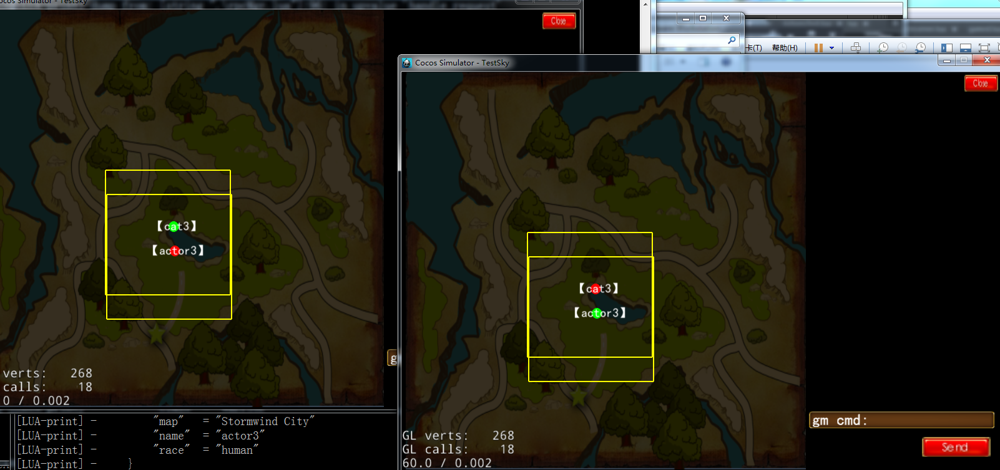

## This a client demo for testing [Testmmo](https://github.com/yangxuan0261/Testmmo)

> Just for study [skynet](https://github.com/cloudwu/skynet) and [mmo](https://github.com/jintiao/some-mmorpg)

1. cocos2dx version 3.8, include module:**login**, **gamestats**, **aoi**
2. lua project (cocos new Test -p com.test.mygame -l lua -d path)
3. lua upgrade to 5.3(for using ***sproto*** rpc framework)
4. include some openssl lib(eg:srp,aes) , lepg and ...
  
5. ignore dir(runtime, simulator,frameworks)

### runtime
self character is red
other character is green
